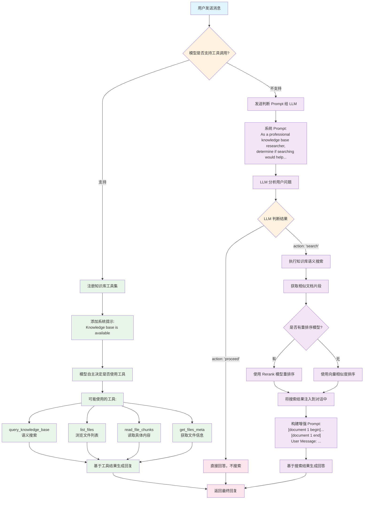
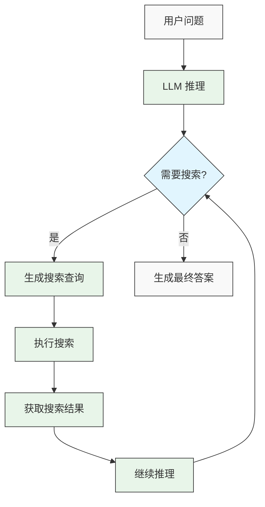

## 1. 阅读收获 (takeaway)
本文旨在祛魅【Agentic RAG】的概念，因此本文的阅读收获包括：
- 了解什么是传统 RAG（Native RAG）
- 了解什么是 Agentic RAG
    - 了解企业级项目 [chatbox](https://github.com/chatbox-ai/chatbox) 的 Agentic RAG 架构和原理
    - 了解如何使用强化学习训练 Agentic RAG （Search-R1）

## 2. 前言

如果说 2024 年，LLM（Large Language Model） 落地最广泛且最有实用价值的一项技术，那么我提名 RAG（Retrieval Augmented Generation) 应该不会有太多的反对。但 2025 年最火的概念变成 Agent，而 **RAG 似乎变成了一个基础组件，提的不多却是融合到了 Agent 的日常使用中了**，尤其是 [OpenAI DeepResearch](https://openai.com/index/introducing-deep-research/) 的出现，让 Agentic RAG 成了 2025 年最成功的 RAG 应用之一。

但网络上有很多文章，把 Agentic RAG 说得玄乎，故意制造难懂的概念从而达到抬高自身的目的。但实际上我们只需要理清楚两个概念，就可以知道什么是 Agentic RAG。
- 传统 RAG 是什么？
	- 预先通过检索排序将知识放到 Prompt 中，然后利用 LLM 生成回复
- Agent 是什么？
	- 使用具有自主决策能力的 Agent 实现的 RAG 系统就可以称为 Agentic RAG。
因此 `Agentic RAG` 实际上就是指在传统 RAG 基础上，加入了 Agent 组件的 RAG 系统，任何实现了 `Agentic Search` 能力的 RAG 系统都可以称为 `Agentic RAG`。

## 3. 传统 RAG （Native RAG）

传统的 RAG（Native RAG）并不是一个复杂的概念，核心概念就两个：检索（Retrieval）和生成（生成）。因此要做好 RAG 就是两件事情：
- 怎么检索到更有用的知识？
- 怎么让模型更好的利用知识生成回复？

因此 RAG 系统架构可以如下图所示：

![[Excalidraw/from-native-rag-to-agentic-rag|from-native-rag-to-agentic-rag]]

`NATIVE RAG`一般来说可以分成两个不同的链路：离线和在线。具体的代码可以参考：[动手学习大模型-中文版-第八章-native-rag 源代码](https://github.com/bbruceyuan/Hands-On-Large-Language-Models-CN/tree/master/chapter08)

```toml
requires-python = ">=3.12"
dependencies = [
    "langchain>=0.3.27",
    "langchain-chroma>=0.2.6",
    "langchain-community>=0.3.30",
    "langchain-deepseek>=0.1.4",
    "langchain-openai>=0.3.34",
    "langgraph>=0.6.8",
]
```

### 3.1 RAG 离线入库

离线入库是指将文档处理成向量并存储到向量数据库中，以便后续检索使用。这个过程主要包括：文档加载、文本切分、向量化、存储。

```python
from langchain_community.document_loaders import TextLoader
from langchain.text_splitter import RecursiveCharacterTextSplitter
from langchain_openai import OpenAIEmbeddings
from langchain_chroma import Chroma

# 1. 加载文档
loader = TextLoader("knowledge_base.txt")
documents = loader.load()

# 2. 文本切分
text_splitter = RecursiveCharacterTextSplitter(
    chunk_size=500,  # 每个文本块的大小
    chunk_overlap=50,  # 文本块之间的重叠部分
)
splits = text_splitter.split_documents(documents)

# 3. 向量化并存储
embeddings = OpenAIEmbeddings(
    base_url="https://api.siliconflow.cn/v1",
    model="Qwen/Qwen3-Embedding-0.6B",
)
vectorstore = Chroma.from_documents(
    documents=splits,
    embedding=embeddings,
    persist_directory="./chroma_db",  # 持久化存储路径
)

print(f"成功将 {len(splits)} 个文本块存入向量数据库")

```

### 3.2 RAG 在线应用

在线应用是指用户提问时，系统检索相关文档并生成回答的过程。主要包括：用户查询、检索相关文档、构建提示词、LLM 生成回答。

```python
from langchain.embeddings import OpenAIEmbeddings
from langchain.vectorstores import Chroma
from langchain_openai import ChatOpenAI
from langchain.prompts import PromptTemplate

# 1. 加载已有的向量数据库
embeddings = OpenAIEmbeddings(
    base_url="https://api.siliconflow.cn/v1",
    model="Qwen/Qwen3-Embedding-0.6B",
)
vectorstore = Chroma(persist_directory="./chroma_db", embedding_function=embeddings)

# 2. 用户提问
query = "什么是RAG？"

# 3. 检索相关文档（返回最相关的 3 个）
docs = vectorstore.similarity_search(query, k=3)

# 4. 将检索到的文档内容拼接成上下文
context = "\n\n".join([doc.page_content for doc in docs])

# 5. 构建 Prompt 模板
prompt_template = """
你是一个专业的问答助手。请根据以下参考文档回答用户的问题。
如果参考文档中没有相关信息，请诚实地说不知道，不要编造答案。

参考文档：
{context}

用户问题：{question}

回答：
"""

prompt = PromptTemplate(
    template=prompt_template,
    input_variables=["context", "question"],
)

# 6. 创建 LLM 并生成回答
llm = ChatOpenAI(
    model="THUDM/glm-4-9b-chat",
    temperature=0,
    max_retries=3,
    base_url="https://api.siliconflow.cn/v1",
)
final_prompt = prompt.format(context=context, question=query)

print(f"最终的 Prompt 内容：{final_prompt}")
response = llm.predict(final_prompt)

# 7. 输出结果
print(f"问题: {query}")
print(f"回答: {response}")
print(f"\n参考文档数量: {len(docs)}")

```

## 4. Agentic RAG 

`Agentic RAG`的核心“**不是更复杂的模型**”，而是“**让模型学会做事**”。和一次性把文档塞进 Prompt 就生成答案的 Native RAG 相比，Agentic RAG 让大模型扮演一个“决策-执行”的控制器：**先制定策略，再调用工具逐步收集证据，最后基于证据作答并给出引用**。

所以说：模型通过自主决策实现的 RAG 过程，我们就可以称之为 `Agentic RAG`。无论这个过程是发现在离线入库阶段（当然 Agentic RAG 其实可以不严格区分 offline/online 截断，都可以让 Agent 自主决策），还是 RAG 生成阶段的 `search query rewrite`，`rerank` 还是 `dynamic search`等，只要有模型的自主决策过程，那么就可以称为 `Agentic RAG`。

如果想了解更多的 [`Agentic RAG`的工业级别](https://github.com/chatboxai/chatbox)的实现，我觉得可以参考「[开源项目 chatbox](https://github.com/chatboxai/chatbox)」的实现，该项目是一个比较早的 LLM Chat 集成的项目，并且算是比较早的实现了 `Agentic RAG`。因为作为一个离线的 LLM chat 项目，对于时延等问题可以有更少的考虑，从而**更激进的、更早阶段将 naive chat 变成 Agentic Chat**。

> 给模型更多的自主决策空间、配备合适的工具，LLM 会给你出乎意料的智能。

### 4.1 Native RAG 有哪些不够好的地方？

- 一次性流水线：通常“检索→拼接→生成”一步到位，没有让模型根据需要调整检索策略、递进式地钻研文档。
- 缺乏任务拆解：问题可能需要先定位文件、再选片段、再比对与总结；Native RAG 往往缺少这样的多步拆解能力。
- 工具编排不足：只会相似度检索，不会进一步查看文件元数据、选择需要阅读的 chunk，更不会在不够时换一种检索或补充查询。
- 证据利用浅：Top-K 拼接容易“糊”上下文，无法进行“先粗后细”的证据收集（coarse→fine），也不容易明确引用到具体片段。
- 适应性差：面对多跳问题（multi-hop）或信息不足的场景，通常不会回溯重试、改写查询、换路子继续找。

### 4.2 什么是 Agentic RAG？

- 让 LLM 作为“智能体（Agent）”充当控制器，结合一组工具（检索、查看元数据、读取片段等）执行“思考→行动→观察”的循环（Reason–Act–Observe）。
- 在回答之前，按需多轮调用工具，逐步从“找到相关文件”走到“读取关键片段”，最后基于被读取的证据组织答案，并给出引用。
- 好处：更强的适应性（可改写查询/追加搜索）、更深的证据利用（读到再答）、更可审计（引用具体来源）。

### 4.3 基于提示词和工具的 Agentic RAG

ReAct 是一个常见的 Agent 实现方式，因此只要给 LLM 配备合适的 `Tool`以及适当的引导 `Prompt`，就可以将一个 `Native RAG` 转换成 `Agentic RAG`。这里我通过解读 `36.8k star`开源企业级项目——[chatbox](https://github.com/chatboxai/chatbox)来讲解一个 Agentic RAG 是怎么实现的，以及为什么它在复杂场景下效果好[^1]。

下面是 `Chatbox` 的整体流程图，可以分为两个部分，左半部分是 `Agentic RAG`，右半部分是介于 `Native RAG` 到 `Agentic RAG`之间的 `Native RAG`。




因此我们重点来解读 `chatbox` 到底是怎么[设置工具](https://github.com/chatboxai/chatbox/blob/9e33c9f998ebf240f31bbb439a430b4d5e5bd3e0/src/renderer/packages/knowledge-base/tools.ts#L78)，来实现更好的 `Agentic Search`，然后再给出最小示例代码：

> 包括 Anthropic 的 context engineering 文章中也提到了`Agentic Seach` 对于 Agent 应用是非常重要的。

- `query_knowledge_base`
	- 在知识库中进行语义搜索，快速找到候选文件或片段的“线索”。通常作为最基础的检索工具
- `get_files_meta`
	- 查看候选文件的元信息（如文件名、大小、chunk 数量），帮助模型决定“读哪几个文件的哪部分”。
- `read_file_chunks`
	- 按文件 `ID + chunkIndex` 精读具体片段，用于“取证”。建议一次只读少量最相关的 `chunk`，以降低噪声。
- `list_files`
	- 列出知识库中的文件清单，作为兜底浏览或当搜索线索不充分时的探索手段。

一个典型的 Agentic RAG 策略是：先粗后细 → 先找候选（query_knowledge_base / list_files）→ 看元信息（get_files_meta）→ 精读片段（read_file_chunks）→ 基于证据组织答案并给出引用。具体代码可以见：[动手学习大模型-中文版-第八章-agentic-rag 源代码](https://github.com/bbruceyuan/Hands-On-Large-Language-Models-CN/tree/master/chapter08)

```python
from typing import List, Dict, Any
from langchain_core.tools import tool
from langchain_openai import ChatOpenAI
from langgraph.prebuilt import create_react_agent

# 假设 kb_controller 由你的平台提供，具备：
# - search(kb_id, query)
# - getFilesMeta(kb_id, file_ids)
# - readFileChunks(kb_id, chunks)
# - listFilesPaginated(kb_id, page, page_size)
kb_controller = ...  # TODO: 替换为你的平台实例
knowledge_base_id = 42

@tool("query_knowledge_base")
def query_knowledge_base(query: str) -> Any:
    """Query a knowledge base"""
    return kb_controller.search(knowledge_base_id, query)

@tool("get_files_meta")
def get_files_meta(fileIds: List[int]) -> Any:
    """Get metadata for files in the current knowledge base."""
    if not fileIds:
        return "Please provide an array of file IDs."
    return kb_controller.getFilesMeta(knowledge_base_id, fileIds)

@tool("read_file_chunks")
def read_file_chunks(chunks: List[Dict[str, int]]) -> Any:
    """Read content chunks from specified files in the current knowledge base."""
    if not chunks:
        return "Please provide an array of chunks to read."
    return kb_controller.readFileChunks(knowledge_base_id, chunks)

@tool("list_files")
def list_files(page: int, pageSize: int) -> Any:
    """List all files in the current knowledge base. Returns file ID, filename, and chunk count for each file."""
    files = kb_controller.listFilesPaginated(knowledge_base_id, page, pageSize)
    return [
        {"id": f["id"], "filename": f["filename"], "chunkCount": f.get("chunk_count", 0)}
        for f in files
        if f.get("status") == "done"
    ]

# 工具清单
tools = [query_knowledge_base, get_files_meta, read_file_chunks, list_files]

# 行为策略（系统提示）
SYSTEM_PROMPT = """你是一个 Agentic RAG 助手。请遵循：
- 先用 query_knowledge_base 搜索；必要时使用 get_files_meta 查看文件信息，或用 list_files 浏览备选。
- 最终必须用 read_file_chunks 读取少量最相关的片段，再基于片段内容作答。
- 不要编造；若证据不足请说明不足并建议下一步。
- 回答末尾用“引用：”列出你实际读取过的 fileId 和 chunkIndex（或文件名）。
"""

# 模型与 Agent
llm = ChatOpenAI(
    model="THUDM/glm-4-9b-chat",
    temperature=0,
    max_retries=3,
    base_url="https://api.siliconflow.cn/v1",
)
agent = create_react_agent(llm, tools, state_modifier=SYSTEM_PROMPT)

# 调用一次
question = "请基于知识库，概述 RAG 的优缺点，并给出引用。"
result = agent.invoke({"messages": [("user", question)]})
final_answer = result["messages"][-1].content
print("答案:\n", final_answer)
```

### 4.4 基于强化学习的 Agentic RAG

这一方向通常用于让 Agent 学会更好的"检索-取证策略"（如何时改写查询、何时追加读取等），而不是依赖人工设计的提示词和规则。前面介绍的基于提示词的 Agentic RAG 虽然有效，但仍然存在一些局限性：

1. 依赖人工设计的提示词和规则，难以适应复杂多变的场景
2. 缺乏对搜索行为的系统性优化，无法从经验中学习和改进
3. 难以处理多轮交互式搜索的复杂决策过程

自 OpenAI-DeepResearch 以及 DeepSeek-R1 发布之后，使用强化学习（RL）来增强模型能力已经是一个常见的做法，其中一个复现 DeepSearch 的代表性工作是 [Search-R1](https://arxiv.org/pdf/2503.09516)，它通过 RL 训练 LLM 学会在推理过程中自主生成搜索查询并利用实时检索结果。

#### 4.4.1 Search-R1：基于 RL 的推理与搜索交织式 LLM

Search-R1 是一个基于强化学习的框架，专为训练具备推理和搜索能力的大语言模型而设计。与传统 RAG 或基于提示词的 Agentic RAG 不同，Search-R1 让模型通过强化学习掌握"何时搜索"、"搜索什么"以及"如何利用搜索结果"的能力。




Search-R1 的核心特点包括：

1. **推理与搜索的交织**：模型可以在推理过程中多次生成搜索查询，获取信息后继续推理，形成"推理-搜索-推理"的循环
2. **自主决策**：模型自主决定何时需要搜索、搜索什么内容，而不是按照固定流程执行
3. **多轮搜索交互**：支持在单次推理过程中进行多轮搜索，每轮搜索都基于当前的推理状态
4. **检索令牌掩码**：使用检索令牌掩码技术确保 RL 训练的稳定性
5. **基于结果的奖励函数**：采用简单的基于结果的奖励函数，鼓励模型生成正确答案

#### 4.4.2 强化学习训练流程

Search-R1 的训练流程主要包括以下步骤：


1. **初始化**：使用预训练的 LLM 作为起点（如 Qwen2.5-7B、Llama3 等）
2. **轨迹生成**：模型生成包含推理步骤和搜索操作的轨迹。
    - 按照特定的格式生成，具体可以参考 Example 样例。
3. **奖励计算**：基于最终答案的正确性计算奖励（只最终答案）
4. **策略优化**：使用 RL 算法（如 PPO、GRPO）优化模型策略

具体的样例可以参考：


```python
# Search-R1 训练伪代码
def train_search_r1(model, optimizer, dataset, search_engine, epochs):
    for epoch in range(epochs):
        for question, ground_truth in dataset:
            # 生成轨迹
            trajectory, actions, log_probs = generate_trajectory(model, question, search_engine)
            
            # 计算奖励
            final_answer = trajectory[-1]
            reward = compute_reward(final_answer, ground_truth)
            
            # 策略优化， 也可以是 conpute_grpo_loss()
            loss = compute_policy_gradient_loss(log_probs, reward)
            optimizer.zero_grad()
            loss.backward()
            optimizer.step()
    
    return model

def generate_trajectory(model, question, search_engine):
    trajectory = []
    actions = []
    log_probs = []
    state = question
    done = False
    
    while not done:
        # 模型推理
        output, action_prob = model(state)  # 返回输出和动作概率
        trajectory.append(output)
        
        # 检查是否需要搜索
        if "<search>" in output:
            # 记录搜索动作和概率
            actions.append("search")
            log_probs.append(action_prob)
            
            # 提取搜索查询
            query = extract_search_query(output)
            
            # 执行搜索
            search_results = search_engine.search(query)
            
            # 更新状态
            state = state + output + search_results
        else:
            # 记录生成答案动作和概率
            actions.append("answer")
            log_probs.append(action_prob)
            
            # 生成最终答案
            done = True
    
    return trajectory, actions, log_probs
```

#### 4.4.3 最小实现示例

以下是 Search-R1 的简化实现示例，展示了如何使用强化学习训练 Agentic RAG 模型：当然实际上 Search-R1 使用的 `GRPO` 算法，我这里用 policy gradient 来演示。

```python
import torch
from transformers import AutoModelForCausalLM, AutoTokenizer
from torch.optim import Adam

model = AutoModelForCausalLM.from_pretrained("Qwen/Qwen2.5-7B")
tokenizer = AutoTokenizer.from_pretrained("Qwen/Qwen2.5-7B")

class SearchEngine:
    def search(self, query):
        # 实现搜索逻辑，返回搜索结果
        # 可以是本地检索器或在线搜索引擎
        pass

def generate_trajectory(model, tokenizer, question, search_engine):
    trajectory = []
    actions = []
    log_probs = []
    state = question
    done = False
    
    while not done:
        # 模型推理
        inputs = tokenizer(state, return_tensors="pt")
        outputs = model.generate(**inputs, max_new_tokens=100, output_scores=True, return_dict_in_generate=True)
        
        # 获取输出文本和概率
        step_output = tokenizer.decode(outputs.sequences[0])
        action_prob = torch.softmax(outputs.scores[-1], dim=-1).max().item()  # 简化处理
        
        trajectory.append(step_output)
        
        # 检查是否需要搜索
        if "<search>" in step_output:
            # 记录搜索动作和概率
            actions.append("search")
            log_probs.append(action_prob)
            
            # 提取搜索查询
            query = extract_search_query(step_output)
            
            # 执行搜索
            search_results = search_engine.search(query)
            
            # 更新状态
            state = state + step_output + search_results
        else:
            # 记录生成答案动作和概率
            actions.append("answer")
            log_probs.append(action_prob)
            
            # 生成最终答案
            done = True
    
    return trajectory, actions, torch.tensor(log_probs)

# 定义 RL 训练函数
def train_rl(model, dataset, search_engine, epochs=3, lr=1e-5):
    optimizer = Adam(model.parameters(), lr=lr)
    
    for epoch in range(epochs):
        for question, answer in dataset:
            # 生成包含搜索操作的轨迹
            with torch.no_grad():
                trajectory, actions, log_probs = generate_trajectory(
                    model, tokenizer, question, search_engine
                )
            
            # 计算奖励
            final_answer = trajectory[-1]
            reward = compute_reward(final_answer, answer)
            
            # 计算策略梯度损失
            policy_loss = -torch.mean(log_probs * reward)
            
            # 更新模型
            optimizer.zero_grad()
            policy_loss.backward()
            optimizer.step()
    
    return model

# 使用训练好的模型进行推理
def inference(model, tokenizer, question, search_engine):
    state = question
    done = False
    steps = []
    
    while not done and len(steps) < 10:
        inputs = tokenizer(state, return_tensors="pt")
        outputs = model.generate(**inputs, max_new_tokens=100)
        step_output = tokenizer.decode(outputs[0])
        steps.append(step_output)
        
        # 检查是否需要搜索
        if "<search>" in step_output:
            # 提取搜索查询
            query = extract_search_query(step_output)
            
            # 执行搜索
            search_results = search_engine.search(query)
            
            # 更新状态
            state = state + step_output + search_results
        else:
            # 生成最终答案
            done = True
    
    return steps[-1]  # 返回最终答案

# 辅助函数：提取搜索查询
def extract_search_query(text):
    # 从文本中提取搜索查询
    # 假设查询格式为 <search>查询内容</search>
    start_tag = "<search>"
    end_tag = "</search>"
    start_idx = text.find(start_tag) + len(start_tag)
    end_idx = text.find(end_tag)
    
    if start_idx >= len(start_tag) and end_idx > start_idx:
        return text[start_idx:end_idx].strip()
    return ""

# 辅助函数：计算奖励
def compute_reward(prediction, ground_truth):

    if prediction == ground_truth:
        return 1.0
    return 0.0
```

## 5 总结比较

相比于基于提示词的 Agentic RAG 和传统 RAG，基于强化学习的 Agentic RAG 有以下优势：

| 方法 | 决策机制 | 搜索能力 | 适应性 | 实现复杂度 |
|------|---------|---------|--------|------------|
| 传统 RAG | 固定流程 | 单次检索 | 低 | 低 |
| 基于提示词的 Agentic RAG | 基于规则 | 多次检索 | 中 | 中 |
| 基于 RL 的 Agentic RAG | 学习优化 | 自适应多次检索 | 高 | 高 |

当然，基于强化学习的 Agentic RAG 也有一些挑战，例如训练成本高、数据依赖等，但目前（2025-10-03）来看，基于强化学习的 Agent 应用（包括 Agentic RAG）仍然是最主流的一种使用方式。


## 6. Ref

[^1]: 以前有过好奇🤔为什么 Chatbox 的 RAG 效果在复杂场景下的 RAG 效果比其他的 chatbox 类产品效果更好，后面阅读源码之后才发现：chatbox 针对于 `file` 相关的工具做了优化，并且因为不用考虑时延等问题，很多决策都通过 `LLM` 完成。